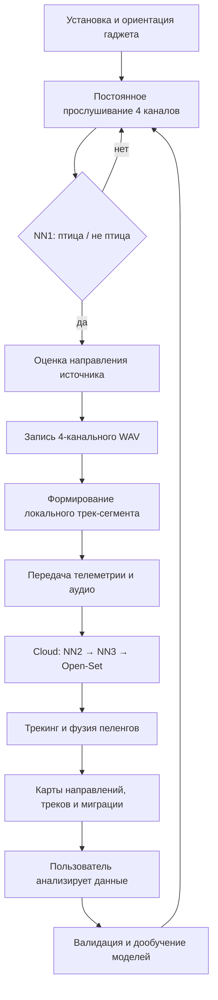

# USERFLOW.md

# USERFLOW

Версия: 2.0
Статус: MVP с 4 микрофонами, направлением источника и траекториями

## 1. Назначение

Сквозной сценарий работы системы акустического мониторинга птиц:

1.  Установка и калибровка гаджета.
2.  Постоянное прослушивание акустической среды.
3.  Детекция птичьих голосов.
4.  Запись аудиофрагмента.
5.  Оценка направления источника звука.
6.  Формирование локальной траектории перемещения.
7.  Передача данных в облако.
8.  Облачная классификация видов.
9.  Построение треков и миграционных карт.
10. Работа пользователя с веб-платформой.

---

## 2. Ключевые допущения

-   Каждый edge-гаджет в MVP оснащен 4 направленными MEMS-микрофонами.
-   Микрофоны ориентированы по сторонам: North / East / South / West.
-   Устройство знает собственную ориентацию относительно севера.
-   Направление источника звука оценивается по 4 каналам: амплитуда, время прихода, SNR.
-   Траектория не является точной GPS-позицией птицы.
-   Траектория строится как вероятностная последовательность пеленгов.
-   При наличии нескольких датчиков облако уточняет траекторию.
-   В MVP полная запись WAV передается в облако преимущественно через рейдовую группу.
-   LoRaWAN используется для короткой телеметрии, включая направление и идентификатор локального трека.

---

## 3. Участники и роли

| Роль | Описание |
| :--- | :--- |
| Edge-гаджет | Слушает среду, детектирует птиц, записывает аудио, оценивает направление, формирует локальные трек-сегменты |
| Полевая группа | Устанавливает датчики, задает ориентацию, обслуживает устройства, забирает SD-карты |
| Cloud Pipeline | Принимает телеметрию и аудио, запускает NN2/NN3, строит треки и карты |
| Web-платформа | Отображает датчики, детекции, направления, треки, тепловые карты и миграционные коридоры |
| Орнитолог | Проверяет сомнительные детекции, валидирует виды и траектории |
| B2B-клиент | Получает комплаенс-отчеты и карты миграционной активности |
| CEO / Product Owner | Отвечает за пилот, клиентов и ценность данных |

---

## 4. Верхнеуровневая схема



---

## 5. Основной сценарий

### 5.1. Установка и подготовка

| Шаг | Действие |
| :--- | :--- |
| 1 | Полевая группа устанавливает гаджет на дереве, мачте или столбе |
| 2 | Фиксируются GPS-координаты, высота установки, ориентация корпуса |
| 3 | Гаджет проверяет 4 микрофонных канала |
| 4 | Выполняется базовая калибровка ориентации относительно севера |
| 5 | Гаджет регистрируется в облаке |
| 6 | Cloud присваивает `device_id` и применяет конфигурацию |
| 7 | Web-платформа отображает датчик как установленный |

Обязательные метаданные установки:

-   `device_id`
-   `gps_lat`, `gps_lon`
-   `install_height_m`
-   `orientation_deg`
-   `mic_layout`: N/E/S/W
-   `install_date`
-   `habitat_type`
-   `field_notes`
-   `photo_ref`

### 5.2. Постоянное прослушивание

| Шаг | Действие |
| :--- | :--- |
| 1 | Гаджет непрерывно захватывает звук по 4 каналам |
| 2 | Аудио поступает в кольцевой буфер |
| 3 | DSP формирует спектрограммы или признаки по каждому каналу |
| 4 | NN1 периодически выполняет инференс |
| 5 | Если птичий голос не обнаружен — запись события не производится |
| 6 | Если вероятность птицы превышает порог — запускается событие |

Режим прослушивания в MVP:

-   постоянный мониторинг в low-power режиме;
-   кольцевой буфер хранит минимум 2 секунды до срабатывания;
-   при детекции сохраняется фрагмент после срабатывания;
-   при деградации батареи допускается adaptive monitoring mode.

### 5.3. Детекция объекта

NN1 принимает решение:

-   `bird_probability ≥ threshold` → событие подтверждено;
-   `bird_probability < threshold` → событие игнорируется.

При подтверждении создаются:

-   `event_id`
-   `timestamp_utc`
-   `bird_probability`
-   `snr_db`
-   `channel_levels`
-   `quality_flags`

### 5.4. Оценка направления источника звука

Для каждого события гаджет оценивает направление источника.

Входные данные:

-   уровни сигнала по 4 каналам: N, E, S, W;
-   время прихода сигнала;
-   соотношение сигнал/шум;
-   ориентация корпуса относительно севера.

Выходные данные:

-   `azimuth_device_deg`: направление относительно корпуса;
-   `azimuth_geo_deg`: направление относительно севера;
-   `sector`: N / NE / E / SE / S / SW / W / NW;
-   `azimuth_confidence`;
-   `bearing_quality`: good / ambiguous / poor.

Пример:

```json
{
  "event_id": "evt-000123",
  "azimuth_device_deg": 62.0,
  "azimuth_geo_deg": 152.0,
  "sector": "SE",
  "azimuth_confidence": 0.78,
  "bearing_quality": "good"
}
```

### 5.5. Запись аудиофрагмента

При срабатывании NN1 гаджет сохраняет:

-   4-канальный WAV;
-   длительность: 10 секунд;
-   pre-roll: 2 секунды до события;
-   post-roll: 8 секунд после события;
-   метаданные события;
-   оценку направления;
-   локальный `track_id`, если событие связано с предыдущими.

Пример имени файла:

```text
2026-08-06_03-15-27_sensor-001_evt-000123.wav
```

### 5.6. Формирование локальной траектории

Если подряд возникает несколько детекций с согласованным изменением пеленга, гаджет формирует локальный трек-сегмент.

Пример последовательности:

| Время | Азимут | Вероятность |
| :--- | ---: | ---: |
| 03:15:27 | 62° | 0.93 |
| 03:15:29 | 68° | 0.91 |
| 03:15:31 | 75° | 0.88 |
| 03:15:34 | 83° | 0.86 |

Локальный трек-сегмент содержит:

-   `track_id`
-   `device_id`
-   `start_time`, `end_time`
-   `event_ids`
-   `mean_bearing`
-   `bearing_change`
-   `track_confidence`
-   `motion_flag`: moving / stationary / unknown

Важно:

-   одиночная детекция дает только направление;
-   серия детекций дает вероятностное направление движения;
-   точная траектория возможна только при нескольких датчиках или дополнительных данных.

### 5.7. Передача данных

#### LoRaWAN-телеметрия

По LoRaWAN передается короткий пакет:

```json
{
  "device_id": "sensor-001",
  "timestamp_utc": "2026-08-06T03:15:27Z",
  "battery_v": 3.71,
  "temperature_c": 14.2,
  "bird_flag": true,
  "bird_probability": 0.93,
  "azimuth_geo_deg": 152.0,
  "azimuth_confidence": 0.78,
  "track_id": "trk-000012",
  "quality": "good"
}
```

#### Передача аудио

-   основной MVP-сценарий: WAV сохраняется на SD;
-   рейдовая группа периодически забирает SD-карты;
-   при наличии LTE возможна передача аудио или архивов в облако.

### 5.8. Облачная обработка

После получения данных облако выполняет:

1.  Валидацию пакетов.
2.  Сохранение телеметрии в TimescaleDB.
3.  Сохранение WAV в object storage.
4.  Запуск NN2 при необходимости.
5.  Классификацию NN3.
6.  Open-Set проверку.
7.  Контроль качества направления.
8.  Объединение событий в треки.
9.  Обновление карт.

Пайплайн:

```text
WAV / telemetry
→ validation
→ NN2 source separation
→ NN3 classification
→ Open-Set Detector
→ Direction QA
→ Tracking Service
→ PostGIS / TimescaleDB
→ Web Platform
```

### 5.9. Построение траекторий

Облачный трекинг использует:

-   направления от одного датчика;
-   серии детекций;
-   временные метки;
-   вид птицы;
-   качество пеленга;
-   данные от соседних датчиков.

Уровни точности:

| Уровень | Описание |
| :--- | :--- |
| L0 | Только одна детекция и пеленг |
| L1 | Серия пеленгов от одного датчика |
| L2 | Несколько датчиков, пересечение пеленгов |
| L3 | Устойчивый миграционный коридор за период |

Результатом является не точный GPS-трек, а вероятностная траектория.

### 5.10. Карты миграции

Web-платформа строит слои:

1.  Датчики.
2.  Детекции.
3.  Направления / пеленги.
4.  Треки.
5.  Тепловые карты активности.
6.  Миграционные коридоры.
7.  Комплаенс-зоны для B2B.

Фильтры:

-   вид;
-   дата;
-   время суток;
-   датчик;
-   уверенность;
-   качество направления;
-   Unknown / known;
-   red-list species.

### 5.11. Пользовательский сценарий

Орнитолог или оператор:

1.  Заходит в веб-платформу.
2.  Выбирает пилотный регион.
3.  Видит карту датчиков.
4.  Включает слой направлений.
5.  Выбирает период: ночь / утро / конкретные сутки.
6.  Включает слой треков.
7.  Смотрит анимацию миграционных потоков.
8.  Открывает конкретное событие.
9.  Прослушивает WAV.
10. Смотрит спектрограмму и пеленг.
11. Подтверждает или исправляет вид.
12. Выгружает CSV / GeoJSON / PDF-отчет.

B2B-клиент:

1.  Открывает свою территорию.
2.  Выбирает период мониторинга.
3.  Получает данные о видах и активности.
4.  Видит направления миграционных потоков.
5.  Получает комплаенс-отчет.
6.  Получает алерт при обнаружении краснокнижного вида.

---

## 6. Альтернативные сценарии

| Ситуация | Поведение системы |
| :--- | :--- |
| NN1 не сработала | Событие не сохраняется, лог может быть использован для дообучения |
| Ложное срабатывание | Облако помечает событие как low confidence или non-bird |
| Неизвестный вид | Open-Set Detector присваивает метку Unknown |
| Низкий SNR | Направление помечается как poor |
| Несколько источников | Событие получает флаг multi_source |
| Нет связи | Данные сохраняются на SD |
| Низкий заряд | Гаджет переходит в adaptive monitoring mode |
| Датчик потерял ориентацию | Требуется полевая проверка и перекалибровка |
| Нет LTE | WAV передается рейдовой группой |
| Противоречивые пеленги | Трек не строится или получает низкую уверенность |

---

## 7. Границы ответственности

### Edge-гаджет отвечает за:

-   постоянный мониторинг;
-   детекцию NN1;
-   запись события;
-   оценку направления;
-   первичный локальный трек;
-   телеметрию;
-   хранение WAV.

### Cloud отвечает за:

-   видовую классификацию;
-   open-set контроль;
-   уточнение качества направления;
-   фузию треков;
-   построение карт;
-   хранение истории;
-   API и веб-аналитику.

### Пользователь отвечает за:

-   интерпретацию данных;
-   валидацию Unknown;
-   корректировку видов;
-   экспорт отчетов;
-   принятие решений по комплаенсу.

---

## 8. Критерии корректного UserFlow

UserFlow считается выполненным, если:

-   гаджет непрерывно слушает пространство;
-   при обнаружении птицы создается событие;
-   сохраняется 4-канальный WAV;
-   каждое событие имеет направление или флаг невозможности оценки;
-   серия событий может быть объединена в локальный трек;
-   телеметрия содержит направление и трек-идентификатор;
-   облако строит видовую классификацию;
-   облако строит карты направлений и треков;
-   пользователь может фильтровать данные по времени, виду и качеству;
-   Unknown-события отправляются на ручную проверку.
```